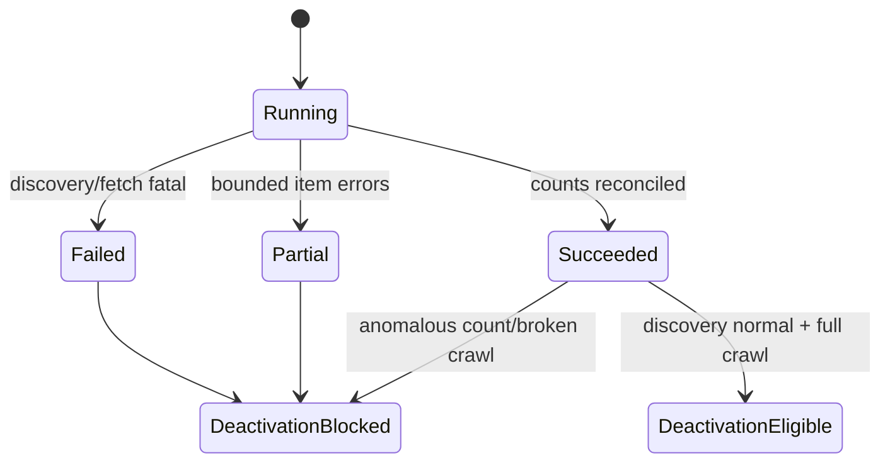

# Update state machine

## Crawl-run gate

Only a successful, non-anomalous full crawl sets `deactivation_allowed=true`. The adapter compares discovered count against a recent successful baseline and supplier policy. A sharp drop blocks mass miss increments/deactivation and raises a crawl error.

## Product/offer transitions

1. **Discovered new** — insert with `first_seen_at=last_seen_at`, `missed_crawls=0`, active true.
2. **Fetched unchanged** — update `last_seen_at`/`last_success_at`, reset misses, do not rewrite heavy groups.
3. **Fetched changed** — compare field-group hashes; update only changed groups, set `last_changed_at`, append history rows for real changes.
4. **Individual 404/410 in a healthy full crawl** — increment `missed_crawls`; keep active until supplier threshold.
5. **Absent from a healthy full discovery** — increment misses once for that run; deactivate only at `deactivate_after_misses`.
6. **Out of stock** — update commercial state only; never deactivate the product.
7. **Redirect/canonical move** — retain old URL as alias and update current URL; stable external identity prevents a duplicate.
8. **Broken/anomalous crawl** — record errors and counts, but do not increment mass misses or deactivate.

Partner-ST starts with `deactivate_after_misses=3`. This is configuration, not a hard-coded global rule.

## Hash groups

- `identity_hash`: external IDs, SKU, name, canonical identity fields.
- `commercial_hash`: price, old price, currency, raw/normalized availability, quantity.
- `description_hash`: description text/HTML.
- `properties_hash`: ordered raw property tuples.
- `images_hash`: ordered image URLs and primary flags.
- `documents_hash`: ordered document URLs/titles/types.
- `category_hash`: memberships and published path.

Hash inputs must be canonically serialized with explicit NULLs and stable ordering. One giant hash is forbidden because it prevents targeted updates.
